# MedTrack ERP - Complete Software Guide

**Version:** 1.0  
**Last Updated:** May 11, 2026  
**Document Type:** Comprehensive Software Architecture & User Guide

---

## Table of Contents

1. [Executive Summary](#executive-summary)
2. [System Architecture](#system-architecture)
3. [User Roles & Permissions](#user-roles--permissions)
4. [Business Modules](#business-modules)
5. [Data Flow Diagrams](#data-flow-diagrams)
6. [Technical Implementation](#technical-implementation)
7. [Missing Features & Gaps](#missing-features--gaps)
8. [API Reference](#api-reference)

---

## Executive Summary

MedTrack is a **Multi-Tenant Manufacturing ERP System** designed to manage the complete lifecycle of manufacturing operations, from sales orders to product delivery. The system is built with a modern microservices-inspired architecture using:

- **Backend:** Python FastAPI with SQLAlchemy ORM
- **Frontend:** React with TypeScript
- **Database:** PostgreSQL
- **Authentication:** JWT-based with Role-Based Access Control (RBAC)

### Key Business Processes Supported

1. **Sales Management:** Customer orders, approvals, pricing
2. **Procurement:** Supplier management, purchase orders, quotations
3. **Inventory Management:** Stock tracking, warehouses, reservations
4. **Manufacturing:** Work orders, production planning, shop floor operations
5. **Quality Control:** Inspections, non-conformance reports
6. **Finance:** Invoicing, payments, ledger management
7. **Reporting:** Analytics, dashboards, document generation

---

## System Architecture

### High-Level Architecture

```
┌─────────────────────────────────────────────────────────────┐
│                     Frontend (React)                        │
│  ┌──────────┐  ┌──────────┐  ┌──────────┐  ┌──────────┐  │
│  │  Sales   │  │Inventory │  │Manufactur│  │ Finance  │  │
│  │ Module   │  │  Module  │  │  ing     │  │ Module   │  │
│  └──────────┘  └──────────┘  └──────────┘  └──────────┘  │
└──────────────────────────┬──────────────────────────────────┘
                           │ HTTPS/JWT
┌──────────────────────────▼──────────────────────────────────┐
│              Backend API (FastAPI)                          │
│  ┌────────────────────────────────────────────────────┐   │
│  │           API Layer (Routes & Dependencies)        │   │
│  └────────────────────────────────────────────────────┘   │
│  ┌────────────────────────────────────────────────────┐   │
│  │         Application Layer (Handlers & Services)    │   │
│  └────────────────────────────────────────────────────┘   │
│  ┌────────────────────────────────────────────────────┐   │
│  │         Domain Layer (Models & Value Objects)      │   │
│  └────────────────────────────────────────────────────┘   │
│  ┌────────────────────────────────────────────────────┐   │
│  │         Infrastructure (DB, JWT, Email)             │   │
│  └────────────────────────────────────────────────────┘   │
└──────────────────────────┬──────────────────────────────────┘
                           │
┌──────────────────────────▼──────────────────────────────────┐
│              PostgreSQL Database                          │
│  ┌──────────┐  ┌──────────┐  ┌──────────┐  ┌──────────┐  │
│  │  Users   │  │Products  │  │WorkOrders │  │Inventory │  │
│  └──────────┘  └──────────┘  └──────────┘  └──────────┘  │
└─────────────────────────────────────────────────────────────┘
```

### Technology Stack

| Layer | Technology | Purpose |
|-------|-----------|---------|
| **Frontend** | React 18 + TypeScript | User interface |
| **Frontend** | TailwindCSS + shadcn/ui | Styling & components |
| **Frontend** | React Router | Navigation |
| **Frontend** | Axios | HTTP client |
| **Backend** | FastAPI | REST API framework |
| **Backend** | SQLAlchemy 2.0 | ORM |
| **Backend** | Pydantic | Data validation |
| **Backend** | Python-JWT | Token authentication |
| **Database** | PostgreSQL 14+ | Primary data store |
| **Task Queue** | Background tasks (async) | Email & notifications |
| **WebSocket** | FastAPI WebSocket | Real-time updates |

---

## User Roles & Permissions

### Role Hierarchy

```
ADMIN (Level 100)
├── Full system access
├── Tenant management
└── All permissions

TENANT_ADMIN (Level 99)
├── Tenant-level admin
├── User management
└── All tenant permissions

MANAGER (Level 50)
├── Operations management
├── Sales approval
└── Cross-module access

PLANNER (Level 45)
├── Production planning
├── BOM management
└── Material requirements

SALES (Level 40)
├── Sales order management
├── Customer management
└── Quotations

STOREKEEPER (Level 35)
├── Inventory management
├── GRN processing
└── Material issuance

OPERATOR (Level 30)
├── Warehouse operations
├── Production execution
└── Quality inspections

QC (Level 28)
├── Quality inspections
├── NCR management
└── Quality reporting

WORKER (Level 25)
├── Shop floor operations
├── Work order execution
└── Time tracking

CLIENT (Level 8)
├── Order placement
├── Order tracking
└── Invoice viewing

SUPPLIER (Level 5)
├── Quotation management
├── Purchase order fulfillment
└── Invoice submission

VIEWER (Level 10)
├── Read-only access
└── Report viewing
```

### Detailed Role Permissions

#### 1. ADMIN / TENANT_ADMIN
**Full Access** - Can perform all operations across all modules.

**Key Capabilities:**
- User management (create, update, delete users)
- Role assignment and permission management
- Tenant configuration
- System settings
- Audit log viewing
- All business operations

**Modules Accessible:** All modules

---

#### 2. MANAGER
**Operations Management** - Oversees sales, manufacturing, procurement, and finance.

**Key Capabilities:**
- View and manage sales orders
- Approve sales orders (PENDING_APPROVAL)
- Manage inventory
- Oversee manufacturing operations
- Manage procurement
- View financial reports
- Quality management
- Generate reports

**Permissions:**
- `admin:read`, `rbac:read`, `tenant:read`, `user:read`
- `inventory:read`, `inventory:write`
- `sales:read`, `sales:write`, `sales:view_orders`, `sales:create_order`, `sales:approve_order`
- `manufacturing:read`, `manufacturing:write`
- `procurement:read`, `procurement:write`
- `finance:read`, `invoice:create`, `invoice:view`, `invoice:approve`, `payment:record`
- `quality:read`, `quality:write`
- `reports:read`
- `storekeeper:read`, `worker:read`

**Modules Accessible:** Dashboard, System Map, Products, BOM, Manufacturing, Inventory, Work Orders, Procurement, Quality, Sales, Finance, Shop Floor, Reports

---

#### 3. PLANNER
**Production Planning** - Plans production schedules and material requirements.

**Key Capabilities:**
- View inventory levels
- Create and manage work orders
- Manage Bill of Materials (BOM)
- Material Requirements Planning (MRP)
- View procurement status
- View production reports

**Permissions:**
- `inventory:read`
- `manufacturing:read`, `manufacturing:write`
- `procurement:read`, `procurement:write`
- `quality:read`
- `reports:read`
- `storekeeper:read`

**Modules Accessible:** Dashboard, BOM, Work Orders, Inventory, Procurement, Reports

---

#### 4. STOREKEEPER
**Inventory Management** - Manages stock, GRNs, and material issuance.

**Key Capabilities:**
- View and manage inventory
- Process Goods Receipt Notes (GRN)
- Reserve stock for work orders
- Issue materials to production
- Handle material returns
- Manage warehouse locations
- View material shortages

**Permissions:**
- `inventory:read`, `inventory:write`
- `manufacturing:read`, `manufacturing:write`
- `quality:read`, `quality:write`
- `procurement:read`, `procurement:write`
- `storekeeper:read`

**Modules Accessible:** Dashboard, Inventory, Work Orders, Procurement

**Key Endpoints:**
- `GET /storekeeper/issue-queue` - View pending material issues
- `GET /storekeeper/shortage-queue` - View material shortages
- `GET /storekeeper/partially-issued-wo` - View partially issued work orders
- `POST /storekeeper/reserve-stock` - Reserve stock for WO
- `POST /storekeeper/issue-material` - Issue material to WO
- `POST /storekeeper/partial-issue` - Partial material issue
- `POST /storekeeper/reject-issue` - Reject material issue
- `POST /storekeeper/return-material` - Return material to inventory

---

#### 5. OPERATOR
**Warehouse & Production Operations** - Handles warehouse tasks and production operations.

**Key Capabilities:**
- Inventory management
- Manufacturing operations
- Material procurement
- Quality inspections
- Stock issuance

**Permissions:**
- `inventory:read`, `inventory:write`
- `manufacturing:read`, `manufacturing:write`
- `quality:read`, `quality:write`
- `procurement:read`, `procurement:write`
- `storekeeper:read`

**Modules Accessible:** Dashboard, Inventory, Work Orders, Procurement, Quality, Manufacturing

---

#### 6. QC (Quality Control)
**Quality Management** - Manages inspections and quality reports.

**Key Capabilities:**
- View inventory
- Perform quality inspections
- Manage non-conformance reports
- View procurement status
- Generate quality reports

**Permissions:**
- `inventory:read`
- `quality:read`, `quality:write`
- `procurement:read`

**Modules Accessible:** Dashboard, Quality, Work Orders, Inventory

---

#### 7. SALES
**Sales Management** - Manages customer orders and quotations.

**Key Capabilities:**
- Create and manage sales orders
- View customer information
- Generate quotations
- View inventory availability
- Create invoices
- View sales reports

**Permissions:**
- `inventory:read`
- `sales:read`, `sales:write`, `sales:view_orders`, `sales:create_order`
- `invoice:create`, `invoice:view`
- `manufacturing:read`
- `reports:read`

**Modules Accessible:** Dashboard, Sales

---

#### 8. ACCOUNTANT
**Financial Management** - Manages finances, invoices, and payments.

**Key Capabilities:**
- View and manage invoices
- Record payments
- Manage supplier invoices
- View ledger
- Financial reporting
- Finance settings

**Permissions:**
- `finance:read`, `finance:write`
- `invoice:create`, `invoice:view`, `invoice:approve`, `payment:record`
- `supplier_invoice:create`, `supplier_invoice:view`, `supplier_payment:record`
- `ledger:view`
- `finance_settings:view`, `finance_settings:write`
- `report:view_financial`
- `reports:read`

**Modules Accessible:** Dashboard, Finance, Reports

---

#### 9. WORKER
**Shop Floor Operations** - Executes production work orders.

**Key Capabilities:**
- View work orders
- Execute production tasks
- Update production progress
- Record scrap/defects
- View inventory

**Permissions:**
- `manufacturing:read`, `manufacturing:write`
- `inventory:read`
- `worker:read`

**Modules Accessible:** Shop Floor

---

#### 10. CLIENT
**Customer Portal** - Places and tracks orders.

**Key Capabilities:**
- View products
- Place sales orders
- Track order status
- View invoices
- View delivery status

**Permissions:**
- `sales:read`, `sales:view_orders`, `sales:create_order`
- `inventory:read`
- `client:read`
- `invoice:view`

**Modules Accessible:** Dashboard, Sales

---

#### 11. SUPPLIER
**Supplier Portal** - Manages quotations and purchase orders.

**Key Capabilities:**
- View purchase orders
- Submit quotations
- Update PO status
- Submit supplier invoices
- View performance rating

**Permissions:**
- `procurement:read`, `procurement:write`
- `supplier:read`, `supplier:write`
- `supplier_invoice:create`, `supplier_invoice:view`

**Modules Accessible:** Supplier Portal

---

#### 12. VIEWER
**Read-Only Access** - Views reports and data.

**Key Capabilities:**
- View inventory
- View sales data
- View manufacturing data
- View procurement data
- View financial data
- View quality data
- View reports

**Permissions:**
- `inventory:read`, `sales:read`, `manufacturing:read`, `procurement:read`, `finance:read`, `quality:read`, `reports:read`

**Modules Accessible:** Dashboard, Inventory, Sales, Reports

---

## Business Modules

### 1. Authentication & User Management

**Purpose:** Handles user authentication, authorization, and user lifecycle management.

**Backend Routes:** `backend/app/interfaces/api/v1/routes/auth.py`

**Key Endpoints:**
- `POST /auth/login` - User login with JWT token generation
- `POST /auth/register-tenant` - Register new tenant with admin user
- `GET /auth/me` - Get current user profile
- `POST /auth/logout` - Logout (client-side token removal)

**Authentication Flow:**

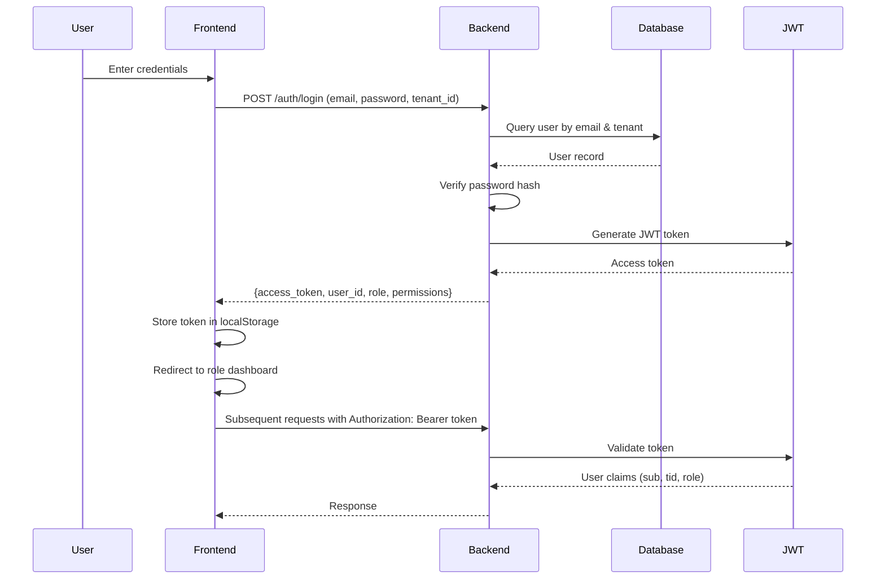

**JWT Token Structure:**
```json
{
  "sub": "user_id (UUID)",
  "tid": "tenant_id (UUID)",
  "role": "role_name (e.g., 'storekeeper')",
  "exp": "expiration_timestamp",
  "iat": "issued_at_timestamp",
  "jti": "token_id (UUID)",
  "sid": "supplier_id (optional)",
  "cid": "client_id (optional)"
}
```

**User Management Routes:** `backend/app/interfaces/api/v1/routes/users.py`

**Key Endpoints:**
- `GET /users` - List users (admin/tenant_admin only)
- `POST /users` - Create new user
- `PUT /users/{id}` - Update user
- `DELETE /users/{id}` - Delete user
- `POST /users/{id}/invite` - Send invitation email
- `POST /users/{id}/reset-password` - Reset user password

**Frontend Module:** `frontend/src/modules/users/`

**Components:**
- `UsersListPage` - Display all users with filters
- `UserForm` - Create/edit user form
- `RoleSelector` - Role selection component
- `PermissionMatrix` - Display role permissions

---

### 2. Tenant Management

**Purpose:** Multi-tenant architecture support for SaaS deployment.

**Backend Routes:** `backend/app/interfaces/api/v1/routes/tenants.py`

**Key Endpoints:**
- `POST /register-tenant` - Register new tenant
- `GET /tenants` - List tenants (admin only)
- `GET /tenants/{id}` - Get tenant details
- `PUT /tenants/{id}` - Update tenant
- `DELETE /tenants/{id}` - Delete tenant

**Tenant Data Model:**
- `id` (UUID) - Unique tenant identifier
- `name` (string) - Tenant company name
- `slug` (string) - URL-friendly identifier
- `plan` (enum) - Subscription plan (free, basic, pro, enterprise)
- `is_active` (boolean) - Active status
- `settings` (JSON) - Tenant-specific settings

**Tenant Isolation:**
- All data is scoped by `tenant_id`
- JWT token includes `tid` claim
- Middleware enforces tenant isolation
- Database queries always include `WHERE tenant_id = ?`

---

### 3. Sales Management

**Purpose:** Manages customer sales orders, quotations, and order lifecycle.

**Backend Routes:** `backend/app/interfaces/api/sales/`

**Key Endpoints:**
- `GET /sales/orders` - List sales orders
- `POST /sales/orders` - Create sales order
- `GET /sales/orders/{id}` - Get order details
- `PUT /sales/orders/{id}` - Update order
- `DELETE /sales/orders/{id}` - Delete order
- `POST /sales/orders/{id}/approve` - Approve order (manager)
- `POST /sales/orders/{id}/reject` - Reject order
- `POST /sales/orders/{id}/cancel` - Cancel order

**Sales Order Status Flow:**

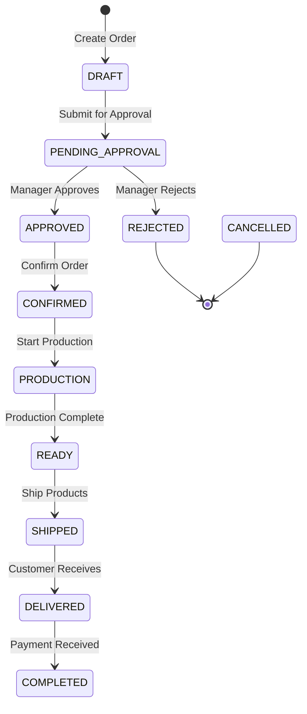

**Sales Order Data Model:**
- `id` (UUID) - Order ID
- `order_number` (string) - Human-readable order number
- `client_id` (UUID) - Customer reference
- `status` (enum) - Order status
- `order_date` (date) - Order placement date
- `delivery_date` (date) - Expected delivery date
- `items` (array) - Order items (product, quantity, price)
- `subtotal` (decimal) - Subtotal before tax
- `tax_amount` (decimal) - Tax amount
- `discount_amount` (decimal) - Discount amount
- `grand_total` (decimal) - Final total
- `approver_id` (UUID) - Manager who approved
- `submitted_at` (timestamp) - Submission time

**Frontend Module:** `frontend/src/modules/sales/`

**Pages:**
- `SalesOrdersPage` - List all sales orders
- `SalesOrderDetailPage` - View/edit order details
- `SalesOrderForm` - Create new order
- `QuotationsPage` - Manage quotations

**Key Components:**
- `OrderStatusBadge` - Display order status
- `OrderItemsTable` - Display order items
- `CustomerSelector` - Select customer
- `ProductSelector` - Select products for order

---

### 4. Procurement Management

**Purpose:** Manages suppliers, purchase orders, and supplier quotations.

**Backend Routes:** `backend/app/interfaces/api/v1/routes/supply_chain.py`

**Key Endpoints:**
- `GET /procurement/suppliers` - List suppliers
- `POST /procurement/suppliers` - Create supplier
- `PUT /procurement/suppliers/{id}` - Update supplier
- `GET /procurement/purchase-orders` - List POs
- `POST /procurement/purchase-orders` - Create PO
- `PUT /procurement/purchase-orders/{id}` - Update PO
- `POST /procurement/purchase-orders/{id}/approve` - Approve PO
- `POST /procurement/purchase-orders/{id}/send` - Send to supplier
- `GET /procurement/quotations` - List supplier quotations
- `POST /procurement/quotations` - Create quotation

**Purchase Order Status Flow:**

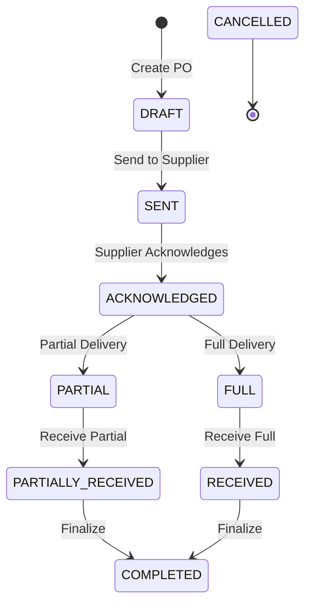

**Purchase Order Data Model:**
- `id` (UUID) - PO ID
- `po_number` (string) - Human-readable PO number
- `supplier_id` (UUID) - Supplier reference
- `status` (enum) - PO status
- `order_date` (date) - Order date
- `expected_delivery` (date) - Expected delivery
- `items` (array) - PO items (material, quantity, price)
- `subtotal` (decimal) - Subtotal
- `tax_amount` (decimal) - Tax
- `grand_total` (decimal) - Total
- `performance_rating` (decimal) - Supplier rating

**Goods Receipt Note (GRN) Process:**

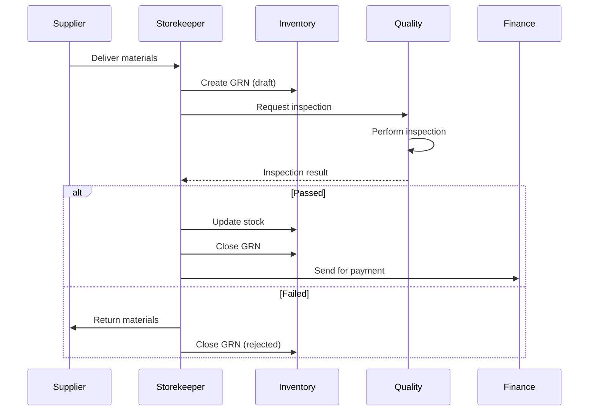

**Frontend Module:** `frontend/src/modules/procurement/`

**Pages:**
- `ProcurementPage` - Main procurement dashboard
- `SuppliersPage` - Manage suppliers
- `PurchaseOrdersPage` - Manage purchase orders
- `QuotationsPage` - Manage quotations

---

### 5. Inventory Management

**Purpose:** Manages stock levels, warehouses, material reservations, and inventory transactions.

**Backend Routes:** `backend/app/interfaces/api/v1/routes/inventory.py`

**Key Endpoints:**
- `GET /inventory/materials` - List materials
- `POST /inventory/materials` - Create material
- `PUT /inventory/materials/{id}` - Update material
- `GET /inventory/stock-levels` - View stock levels
- `GET /inventory/warehouses` - List warehouses
- `GET /inventory/locations` - List storage locations
- `POST /inventory/stock-adjustment` - Manual stock adjustment
- `GET /inventory/transactions` - View transaction history
- `GET /inventory/low-stock` - Low stock alerts

**Material Data Model:**
- `id` (UUID) - Material ID
- `code` (string) - Material code/SKU
- `name` (string) - Material name
- `description` (text) - Description
- `category` (string) - Category
- `unit_of_measure` (string) - UoM (kg, pcs, m, etc.)
- `current_stock` (decimal) - Current quantity
- `reorder_level` (decimal) - Reorder point
- `current_cost` (decimal) - Current unit cost
- `standard_cost` (decimal) - Standard cost
- `supplier_id` (UUID) - Default supplier

**Stock Movement Types:**
- `RECEIPT` - From PO/GRN
- `ISSUE` - To production/work order
- `RETURN` - From production
- `ADJUSTMENT` - Manual correction
- `TRANSFER` - Between locations
- `SCRAP` - Wasted material

**Frontend Module:** `frontend/src/modules/inventory/`

**Pages:**
- `InventoryPage` - Main inventory dashboard
- `MaterialsPage` - Material master data
- `StockLevelsPage` - Stock level monitoring
- `WarehousesPage` - Warehouse management
- `TransactionsPage` - Transaction history

**Key Features:**
- Real-time stock tracking
- Low stock alerts
- Multi-warehouse support
- Batch/serial tracking
- FIFO/LIFO costing methods

---

### 6. Product & BOM Management

**Purpose:** Manages finished products and Bill of Materials (recipes for production).

**Backend Routes:** 
- `backend/app/interfaces/api/v1/routes/products.py`
- `backend/app/interfaces/api/v1/routes/boms.py`

**Product Endpoints:**
- `GET /products` - List products
- `POST /products` - Create product
- `PUT /products/{id}` - Update product
- `DELETE /products/{id}` - Delete product

**BOM Endpoints:**
- `GET /bom` - List BOMs
- `POST /bom` - Create BOM
- `GET /bom/{id}` - Get BOM details
- `PUT /bom/{id}` - Update BOM
- `POST /bom/{id}/items` - Add BOM item
- `DELETE /bom/{id}/items/{item_id}` - Remove BOM item
- `GET /bom/{id}/explode` - Explode BOM (multi-level)

**Product Data Model:**
- `id` (UUID) - Product ID
- `code` (string) - Product code
- `name` (string) - Product name
- `description` (text) - Description
- `category` (string) - Product category
- `uom` (string) - Unit of measure
- `standard_cost` (decimal) - Standard cost
- `selling_price` (decimal) - Selling price
- `is_active` (boolean) - Active status

**BOM Data Model:**
- `id` (UUID) - BOM ID
- `product_id` (UUID) - Finished product
- `version` (string) - BOM version
- `effective_date` (date) - Effective from date
- `items` (array) - BOM items:
  - `material_id` - Raw material
  - `quantity` - Quantity per unit
  - `uom` - Unit of measure
  - `scrap_percentage` - Expected scrap %age

**BOM Explosion Flow:**

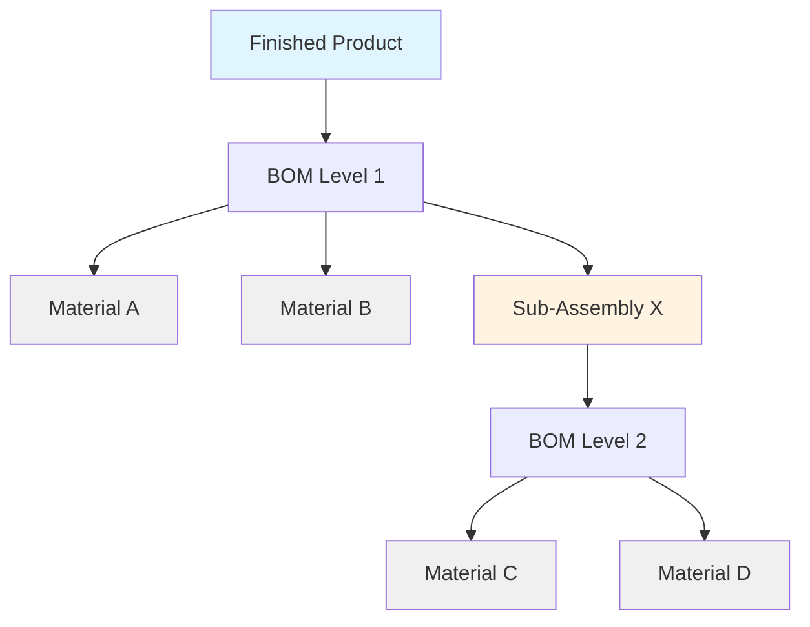

**Frontend Modules:**
- `frontend/src/modules/products/`
- `frontend/src/modules/bom/`

---

### 7. Manufacturing & Work Orders

**Purpose:** Manages production planning, work orders, and shop floor execution.

**Backend Routes:** `backend/app/interfaces/api/v1/routes/work_orders.py`

**Key Endpoints:**
- `GET /work-orders` - List work orders
- `POST /work-orders` - Create work order
- `GET /work-orders/{id}` - Get WO details
- `PUT /work-orders/{id}` - Update WO
- `POST /work-orders/{id}/release` - Release to production
- `POST /work-orders/{id}/start` - Start production
- `POST /work-orders/{id}/complete` - Mark complete
- `POST /work-orders/{id}/cancel` - Cancel WO
- `POST /work-orders/{id}/pause` - Pause production
- `POST /work-orders/{id}/resume` - Resume production

**Work Order Status Flow:**

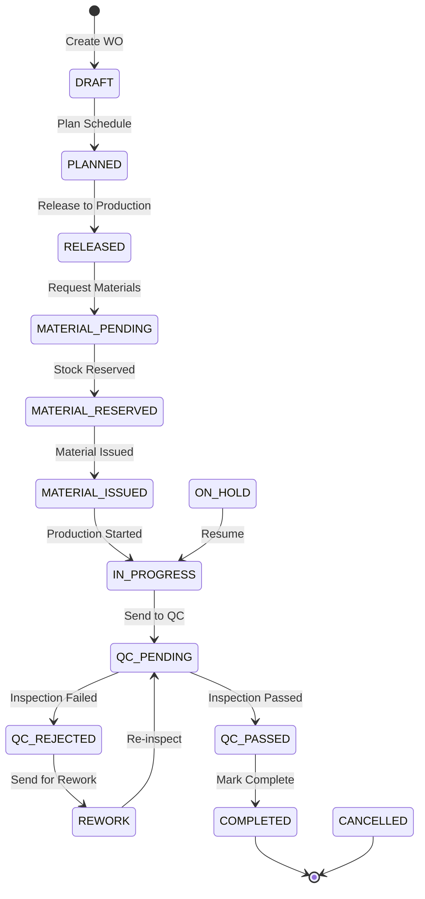

**Work Order Data Model:**
- `id` (UUID) - WO ID
- `wo_number` (string) - Work order number
- `product_id` (UUID) - Product to manufacture
- `status` (enum) - Current status
- `planned_quantity` (decimal) - Planned quantity
- `produced_quantity` (decimal) - Produced quantity
- `scrap_quantity` (decimal) - Scrap quantity
- `planned_start_date` (date) - Planned start
- `planned_end_date` (date) - Planned end
- `actual_start_date` (date) - Actual start
- `actual_end_date` (date) - Actual end
- `bom_version` (string) - BOM version used
- `assigned_worker_id` (UUID) - Assigned worker

**Material Planning for WO:**

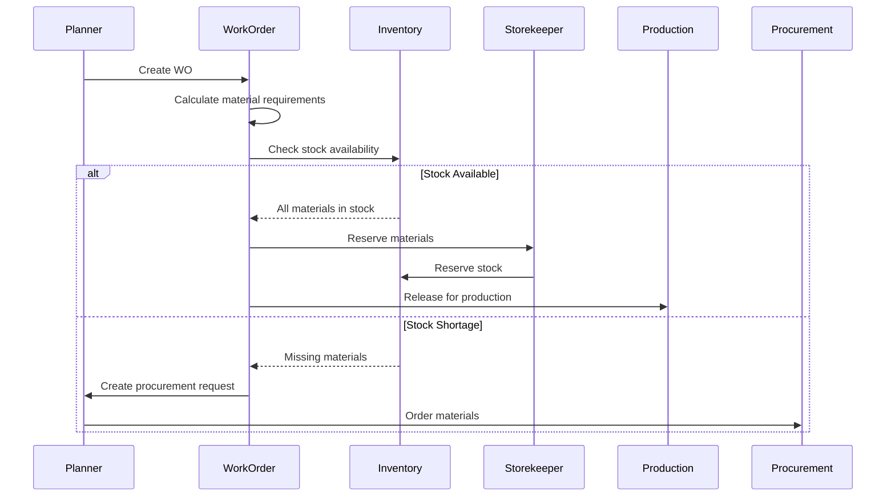

**Frontend Module:** `frontend/src/modules/work-orders/`

**Pages:**
- `WorkOrdersPage` - List all work orders
- `WorkOrderDetailPage` - WO details with operations
- `WorkOrderForm` - Create new WO

---

### 8. Quality Control

**Purpose:** Manages quality inspections, non-conformance reports, and quality standards.

**Backend Routes:** `backend/app/interfaces/api/v1/routes/quality_control.py`

**Key Endpoints:**
- `GET /quality/inspections` - List inspections
- `POST /quality/inspections` - Create inspection
- `PUT /quality/inspections/{id}` - Update inspection
- `GET /quality/inspections/{id}/complete` - Complete inspection
- `GET /quality/ncr` - List non-conformance reports
- `POST /quality/ncr` - Create NCR
- `GET /quality/ncr/{id}/resolve` - Resolve NCR
- `GET /quality/inspection-templates` - List templates

**Inspection Status Flow:**

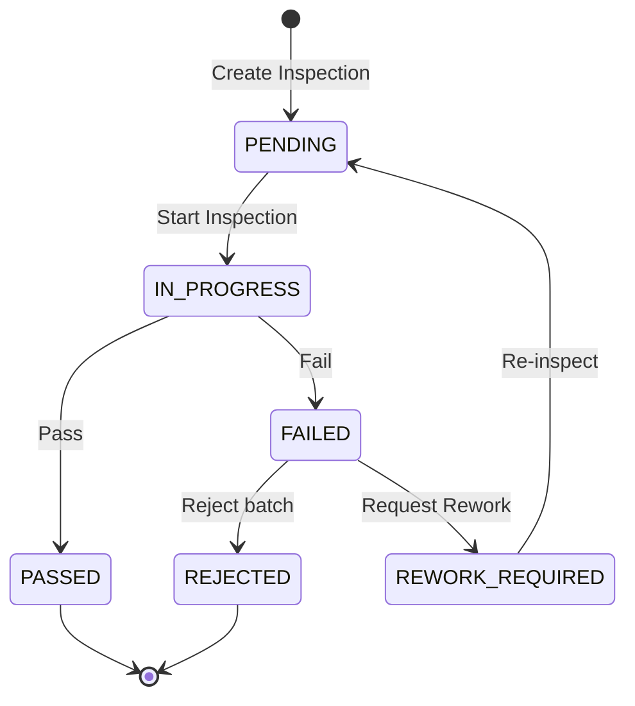

**Inspection Data Model:**
- `id` (UUID) - Inspection ID
- `inspection_number` (string) - Inspection number
- `work_order_id` (UUID) - Related WO
- `material_id` (UUID) - Material being inspected
- `type` (enum) - Inspection type (incoming, in-process, final)
- `status` (enum) - Inspection status
- `result` (enum) - Result (passed, failed, conditional)
- `inspector_id` (UUID) - QC inspector
- `inspection_date` (date) - Inspection date
- `criteria` (array) - Inspection criteria
- `defects` (array) - Defects found

**NCR (Non-Conformance Report) Data Model:**
- `id` (UUID) - NCR ID
- `ncr_number` (string) - NCR number
- `inspection_id` (UUID) - Related inspection
- `severity` (enum) - Severity (minor, major, critical)
- `description` (text) - Issue description
- `root_cause` (text) - Root cause analysis
- `corrective_action` (text) - Corrective action
- `status` (enum) - Status (open, in_progress, resolved, closed)
- `assigned_to` (UUID) - Assigned person

**Frontend Module:** `frontend/src/modules/quality/`

**Pages:**
- `QualityDashboardPage` - QC dashboard
- `InspectionsPage` - Inspection list
- `InspectionDetailPage` - Inspection details
- `NCRPage` - Non-conformance reports

---

### 9. Finance Management

**Purpose:** Manages invoices, payments, ledger, and financial reporting.

**Backend Routes:** `backend/app/interfaces/api/v1/routes/finance.py`

**Key Endpoints:**
- `GET /finance/invoices` - List invoices
- `POST /finance/invoices` - Create invoice
- `PUT /finance/invoices/{id}` - Update invoice
- `POST /finance/invoices/{id}/approve` - Approve invoice
- `POST /finance/invoices/{id}/pay` - Record payment
- `GET /finance/payments` - List payments
- `GET /finance/ledger` - View ledger
- `GET /finance/reports/aging` - Aging report
- `GET /finance/reports/profit-loss` - P&L report

**Invoice Status Flow:**

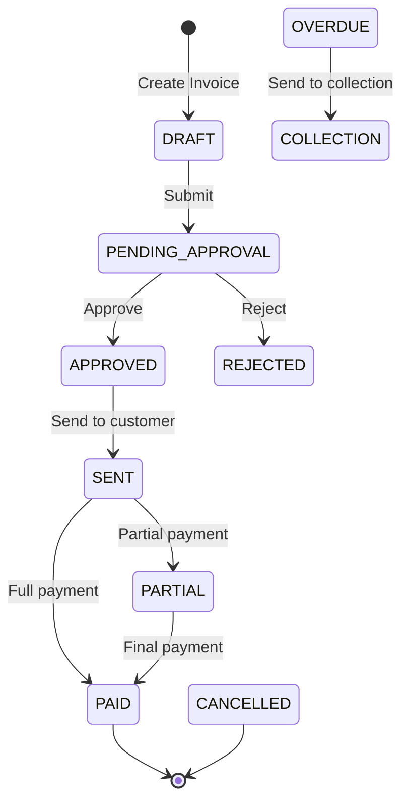

**Invoice Data Model:**
- `id` (UUID) - Invoice ID
- `invoice_number` (string) - Invoice number
- `type` (enum) - Type (sales, purchase)
- `reference_id` (UUID) - Reference (SO/PO)
- `customer_id` / `supplier_id` (UUID) - Party
- `status` (enum) - Invoice status
- `invoice_date` (date) - Invoice date
- `due_date` (date) - Due date
- `subtotal` (decimal) - Subtotal
- `tax_amount` (decimal) - Tax
- `total_amount` (decimal) - Total
- `amount_paid` (decimal) - Amount paid
- `balance_due` (decimal) - Balance

**Payment Data Model:**
- `id` (UUID) - Payment ID
- `payment_number` (string) - Payment number
- `invoice_id` (UUID) - Related invoice
- `amount` (decimal) - Payment amount
- `payment_date` (date) - Payment date
- `payment_method` (enum) - Method (cash, bank, card, etc.)
- `reference` (string) - Reference number

**Frontend Module:** `frontend/src/modules/finance/`

**Pages:**
- `FinanceDashboardPage` - Finance dashboard
- `InvoicesPage` - Invoice management
- `PaymentsPage` - Payment tracking
- `ReportsPage` - Financial reports

---

### 10. Reporting & Analytics

**Purpose:** Generates business reports, dashboards, and analytics.

**Backend Routes:** `backend/app/interfaces/api/v1/routes/reports.py`

**Key Endpoints:**
- `GET /reports/sales` - Sales reports
- `GET /reports/inventory` - Inventory reports
- `GET /reports/production` - Production reports
- `GET /reports/finance` - Financial reports
- `GET /reports/quality` - Quality reports
- `POST /reports/custom` - Generate custom report
- `GET /reports/dashboards/{type}` - Dashboard data

**Report Types:**
- **Sales Reports:** Revenue by period, top customers, product sales
- **Inventory Reports:** Stock levels, turnover, valuation, aging
- **Production Reports:** WO completion, scrap rates, efficiency
- **Finance Reports:** P&L, cash flow, aging, balance sheet
- **Quality Reports:** Inspection pass rates, NCR trends

**Frontend Module:** `frontend/src/modules/analytics/`

**Pages:**
- `AnalyticsDashboard` - Main analytics dashboard
- `ReportsPage` - Report generation
- `CustomReportBuilder` - Custom report builder

---

### 11. Shop Floor Management

**Purpose:** Manages shop floor operations, worker assignments, and production tracking.

**Backend Routes:** `backend/app/interfaces/api/v1/routes/worker.py`

**Key Endpoints:**
- `GET /shop-floor/assignments` - Worker assignments
- `POST /shop-floor/assignments` - Assign worker to operation
- `GET /shop-floor/operations` - List operations
- `POST /shop-floor/operations/{id}/start` - Start operation
- `POST /shop-floor/operations/{id}/complete` - Complete operation
- `POST /shop-floor/operations/{id}/report-scrap` - Report scrap

**Operation Status Flow:**

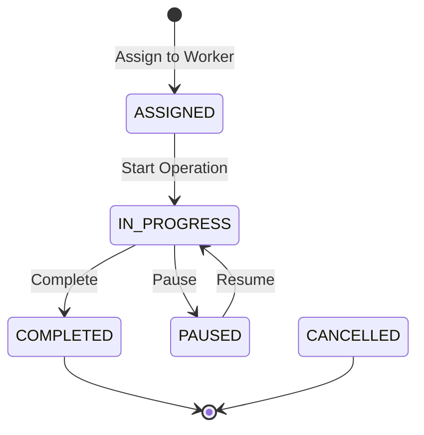

**Frontend Module:** `frontend/src/modules/shop-floor/`

**Pages:**
- `ShopFloorDashboard` - Shop floor dashboard
- `WorkerAssignmentsPage` - Worker assignments
- `OperationsPage` - Operation tracking

---

### 12. Document Management

**Purpose:** Manages document generation, storage, and retrieval.

**Backend Routes:** `backend/app/interfaces/api/v1/routes/documents.py`

**Key Endpoints:**
- `GET /documents` - List documents
- `POST /documents` - Upload document
- `GET /documents/{id}` - Download document
- `DELETE /documents/{id}` - Delete document
- `POST /documents/generate/{type}` - Generate document (invoice, PO, etc.)

**Document Types:**
- Sales Order PDF
- Purchase Order PDF
- Invoice PDF
- Delivery Note
- Quality Certificate
- Inspection Report

**Frontend Module:** Documents integrated across modules

---

### 13. Notifications

**Purpose:** Real-time notifications for important events.

**Backend Routes:** `backend/app/interfaces/api/v1/routes/notifications.py`

**Key Endpoints:**
- `GET /notifications` - List user notifications
- `PUT /notifications/{id}/read` - Mark as read
- `PUT /notifications/read-all` - Mark all as read

**Notification Types:**
- Order approval required
- Material shortage alert
- Inspection required
- Payment overdue
- WO completion

**WebSocket Integration:**
- Real-time push notifications
- Live updates for dashboards
- Order status changes

---

### 14. Audit Logging

**Purpose:** Tracks all system changes for compliance and debugging.

**Backend Routes:** `backend/app/interfaces/api/v1/routes/audit_logs.py`

**Key Endpoints:**
- `GET /audit-logs` - List audit logs (admin only)
- `GET /audit-logs/{id}` - Get log details

**Audit Log Data:**
- Timestamp
- User who made change
- Action performed
- Entity affected
- Old value
- New value
- IP address

---

### 15. MRP (Material Requirements Planning)

**Purpose:** Calculates material requirements based on production schedule.

**Backend Routes:** `backend/app/interfaces/api/v1/routes/mrp.py`

**Key Endpoints:**
- `GET /mrp/run` - Run MRP calculation
- `GET /mrp/plans` - List MRP plans
- `GET /mrp/suggestions` - View procurement suggestions
- `POST /mrp/plans/{id}/approve` - Approve plan

**MRP Calculation Flow:**

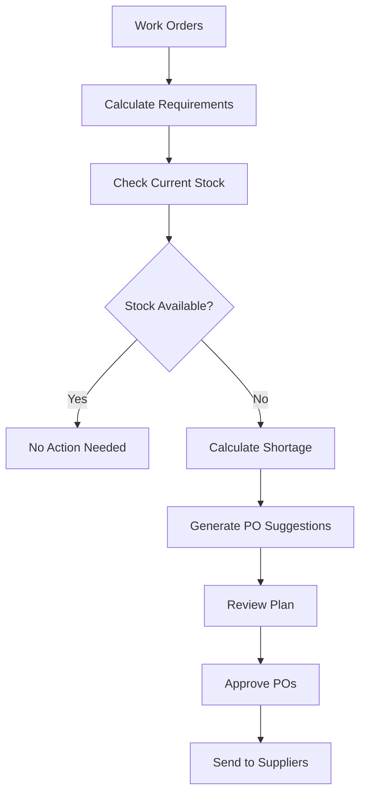

**Frontend Module:** `frontend/src/modules/mrp/`

---

### 16. Client Portal

**Purpose:** Self-service portal for customers to place and track orders.

**Backend Routes:** `backend/app/interfaces/api/v1/routes/client_portal.py`

**Key Endpoints:**
- `GET /client/orders` - View my orders
- `POST /client/orders` - Create order
- `GET /client/orders/{id}/track` - Track order
- `GET /client/invoices` - View my invoices
- `GET /client/profile` - View profile

**Frontend Module:** `frontend/src/modules/client/`

---

### 17. Supplier Portal

**Purpose:** Self-service portal for suppliers to manage POs and quotations.

**Backend Routes:** Integrated into supply_chain.py with supplier-specific endpoints

**Key Endpoints:**
- `GET /supplier/purchase-orders` - View POs assigned to me
- `PUT /supplier/purchase-orders/{id}/acknowledge` - Acknowledge PO
- `POST /supplier/quotations` - Submit quotation
- `GET /supplier/invoices` - View submitted invoices
- `POST /supplier/invoices` - Submit invoice

**Frontend:** Separate supplier portal application

---

## Data Flow Diagrams

### Complete Order-to-Cash Flow

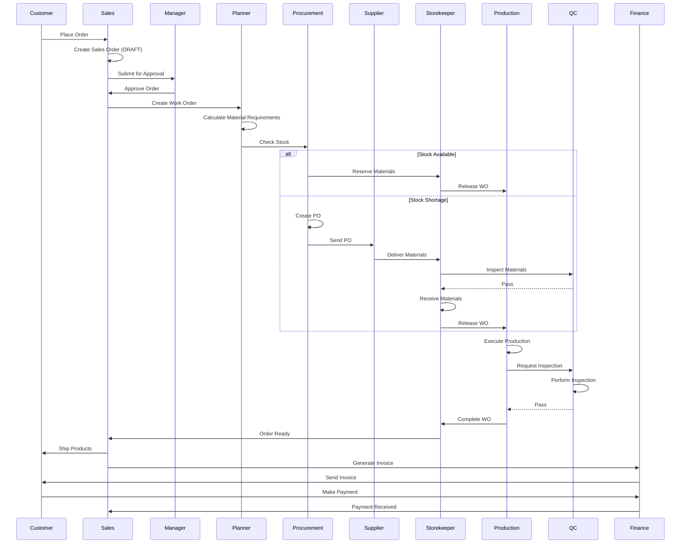

### Procurement-to-Pay Flow

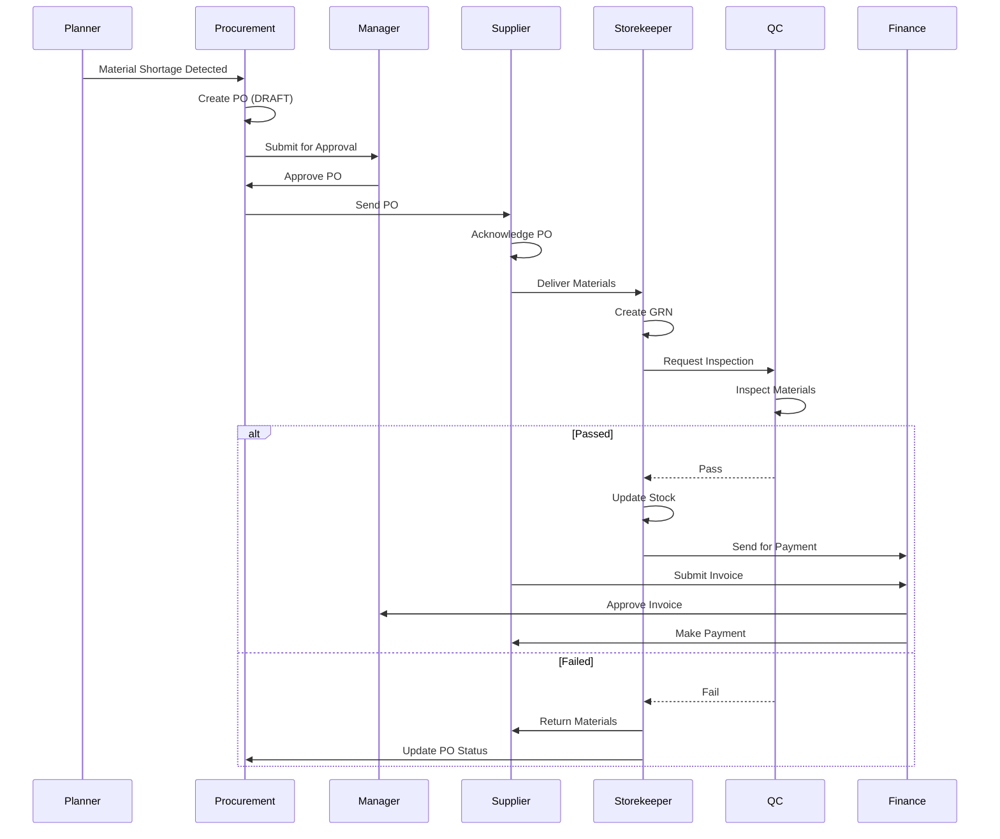

### Production Execution Flow

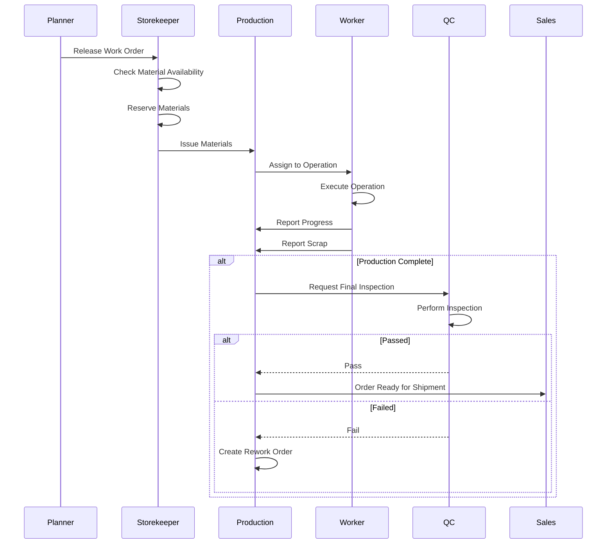

---

## Technical Implementation

### Backend Architecture

**Directory Structure:**
```
backend/
├── app/
│   ├── application/          # Business logic layer
│   │   ├── commands/        # Command objects (CQRS)
│   │   ├── handlers/        # Command handlers
│   │   ├── services/        # Application services
│   │   └── queries/         # Query handlers
│   ├── domain/              # Domain models
│   │   ├── shared/          # Shared domain logic
│   │   └── tenant/          # Tenant domain
│   ├── infrastructure/      # External concerns
│   │   ├── persistence/     # Database models
│   │   ├── security/        # JWT, password hashing
│   │   └── logging/         # Logging utilities
│   └── interfaces/          # API layer
│       └── api/v1/
│           ├── routes/      # API endpoints
│           ├── dependencies/ # FastAPI dependencies
│           ├── schemas/     # Pydantic schemas
│           └── middleware/  # Middleware
```

**Key Design Patterns:**
1. **CQRS (Command Query Responsibility Segregation):** Separate read/write operations
2. **Dependency Injection:** Container-based DI
3. **Repository Pattern:** Abstract data access
4. **Unit of Work:** Transaction management
5. **Event Sourcing:** Domain events for cross-module communication

### Frontend Architecture

**Directory Structure:**
```
frontend/src/
├── app/
│   ├── routes/             # React Router configuration
│   ├── store/              # State management (Zustand)
│   └── layouts/            # Layout components
├── components/             # Shared components
├── modules/                # Feature modules
│   ├── sales/
│   ├── inventory/
│   ├── manufacturing/
│   └── ...
├── services/               # API clients
├── lib/                    # Utilities & configurations
│   ├── roles.config.ts     # Role definitions
│   ├── permissions.config.ts
│   └── constants.ts
└── types/                  # TypeScript type definitions
```

**State Management:**
- **Zustand** for global state (auth, user, theme)
- **React Query** for server state caching
- **Context API** for component-level state

**API Client:**
- Axios-based HTTP client
- Request/response interceptors
- Automatic token injection
- 401 error handling with auto-logout

---

## Missing Features & Gaps

### Critical Missing Features

1. **Advanced Reporting**
   - Custom report builder (partially implemented)
   - Scheduled reports
   - Export to Excel/PDF (basic PDF implemented)
   - Report templates

2. **Advanced Inventory Features**
   - Batch expiration tracking
   - Serial number tracking (basic structure exists)
   - Lot tracking
   - Multi-location transfers
   - Cycle counting
   - ABC analysis

3. **Production Planning**
   - Capacity planning
   - Resource scheduling
   - Gantt charts
   - Production calendar
   - Bottleneck analysis

4. **Quality Management**
   - Sampling plans
   - Quality standards library
   - Supplier quality ratings
   - Statistical process control (SPC)
   - Calibration management

5. **Finance**
   - Multi-currency support
   - Tax management
   - Budgeting
   - Forecasting
   - Cash flow management
   - Bank reconciliation

6. **Integration**
   - Email notifications (basic structure exists)
   - SMS notifications
   - Third-party integrations (payment gateways, shipping)
   - API webhooks
   - EDI support

### Medium Priority Gaps

1. **User Experience**
   - Advanced filtering and search
   - Bulk operations
   - Data import/export
   - Keyboard shortcuts
   - Mobile responsiveness

2. **Security**
   - Two-factor authentication (2FA structure exists)
   - IP whitelisting
   - Session timeout
   - Password policies
   - Audit trail improvements

3. **Performance**
   - Database indexing optimization
   - Caching layer (Redis)
   - Query optimization
   - Lazy loading for large datasets
   - Background job queue (Celery)

4. **Testing**
   - Unit tests (some exist)
   - Integration tests
   - E2E tests (some exist)
   - Performance tests
   - Load testing

### Low Priority Enhancements

1. **Advanced Features**
   - AI-powered demand forecasting
   - Automated procurement suggestions
   - Predictive maintenance
   - Blockchain for supply chain traceability
   - Mobile app

2. **Localization**
   - Multi-language support
   - Multi-currency
   - Regional compliance (GDPR, etc.)
   - Time zone handling

---

## Implementation Status

### Completed Modules ✅

| Module | Backend | Frontend | Status |
|--------|---------|----------|--------|
| Authentication | ✅ | ✅ | Complete |
| User Management | ✅ | ✅ | Complete |
| Tenant Management | ✅ | ⚠️ | Backend only |
| Sales Orders | ✅ | ✅ | Complete |
| Procurement | ✅ | ✅ | Complete |
| Inventory | ✅ | ✅ | Complete |
| Products | ✅ | ✅ | Complete |
| BOM | ✅ | ✅ | Complete |
| Work Orders | ✅ | ✅ | Complete |
| Quality Control | ✅ | ✅ | Complete |
| Finance | ✅ | ✅ | Partial |
| Reporting | ✅ | ✅ | Basic |
| Shop Floor | ✅ | ✅ | Basic |
| Storekeeper | ✅ | ⚠️ | Backend only |
| Worker | ✅ | ⚠️ | Backend only |
| Notifications | ✅ | ✅ | Basic |
| Audit Logs | ✅ | ⚠️ | Backend only |
| Documents | ✅ | ⚠️ | Backend only |
| MRP | ✅ | ⚠️ | Backend only |
| Client Portal | ✅ | ✅ | Basic |
| Supplier Portal | ✅ | ⚠️ | Backend only |

### Legend
- ✅ Complete
- ⚠️ Partial / Basic implementation
- ❌ Not implemented

---

## API Reference

### Authentication Endpoints

#### Login
```
POST /api/v1/auth/login
Content-Type: application/json

Request:
{
  "email": "user@example.com",
  "password": "password123",
  "tenant_id": "uuid-string"
}

Response:
{
  "access_token": "jwt-token",
  "token_type": "bearer",
  "user_id": "uuid",
  "tenant_id": "uuid",
  "email": "user@example.com",
  "role": "storekeeper",
  "full_name": "John Doe"
}
```

#### Get Current User
```
GET /api/v1/auth/me
Authorization: Bearer {token}

Response:
{
  "user": {
    "id": "uuid",
    "email": "user@example.com",
    "first_name": "John",
    "last_name": "Doe",
    "role": "storekeeper",
    "tenant_id": "uuid",
    "is_active": true
  },
  "tenant": {
    "id": "uuid",
    "name": "Company Name",
    "slug": "company-name",
    "plan": "pro",
    "is_active": true
  },
  "permissions": ["inventory:read", "inventory:write", ...]
}
```

### Storekeeper Endpoints

#### Get Issue Queue
```
GET /api/v1/storekeeper/issue-queue
Authorization: Bearer {token}

Response:
[
  {
    "work_order_id": "uuid",
    "wo_number": "WO-001",
    "material_id": "uuid",
    "material_code": "MAT-001",
    "material_name": "Steel Sheet",
    "required_quantity": 100.0,
    "unit": "kg",
    "reserved_quantity": 0.0,
    "issued_quantity": 0.0,
    "status": "MATERIAL_PENDING"
  }
]
```

#### Reserve Stock
```
POST /api/v1/storekeeper/reserve-stock
Authorization: Bearer {token}
Content-Type: application/json

Request:
{
  "work_order_id": "uuid",
  "material_id": "uuid",
  "quantity": 100.0,
  "unit_id": "uuid"
}

Response:
{
  "status": "success",
  "message": "Stock reserved"
}
```

### Work Order Endpoints

#### Create Work Order
```
POST /api/v1/work-orders
Authorization: Bearer {token}
Content-Type: application/json

Request:
{
  "product_id": "uuid",
  "planned_quantity": 1000.0,
  "planned_start_date": "2026-05-15",
  "planned_end_date": "2026-05-20"
}

Response:
{
  "id": "uuid",
  "wo_number": "WO-001",
  "status": "DRAFT",
  ...
}
```

#### Release Work Order
```
POST /api/v1/work-orders/{id}/release
Authorization: Bearer {token}

Response:
{
  "status": "success",
  "message": "Work order released",
  "wo_status": "MATERIAL_PENDING"
}
```

---

## Conclusion

This guide provides a comprehensive overview of the MedTrack ERP system. The system is well-architected with clear separation of concerns, role-based access control, and multi-tenant support.

### Strengths
- Modern tech stack (FastAPI, React, PostgreSQL)
- Clean architecture with CQRS pattern
- Comprehensive RBAC system
- Multi-tenant architecture
- Real-time notifications via WebSocket
- Extensible design

### Areas for Improvement
- Complete frontend implementations for all modules
- Add advanced reporting capabilities
- Implement comprehensive testing
- Add performance optimizations (caching, indexing)
- Enhance security (2FA, audit trail)
- Add integrations (email, SMS, payment gateways)

### Next Steps for Development
1. Complete missing frontend modules
2. Implement advanced reporting
3. Add comprehensive test coverage
4. Performance optimization
5. Security hardening
6. Documentation updates
7. User training materials

---

**Document Version:** 1.0  
**Author:** System Architecture Team  
**Last Review:** May 11, 2026
